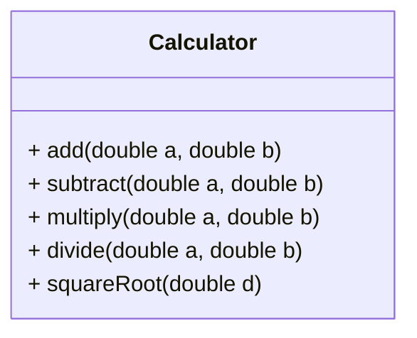

```mermaid
classDiagram
    class Calculator {
        + add(double a, double b)
        + subtract(double a, double b)
        + multiply(double a, double b)
        + divide(double a, double b)
        + squareRoot(double d)
    }
```
