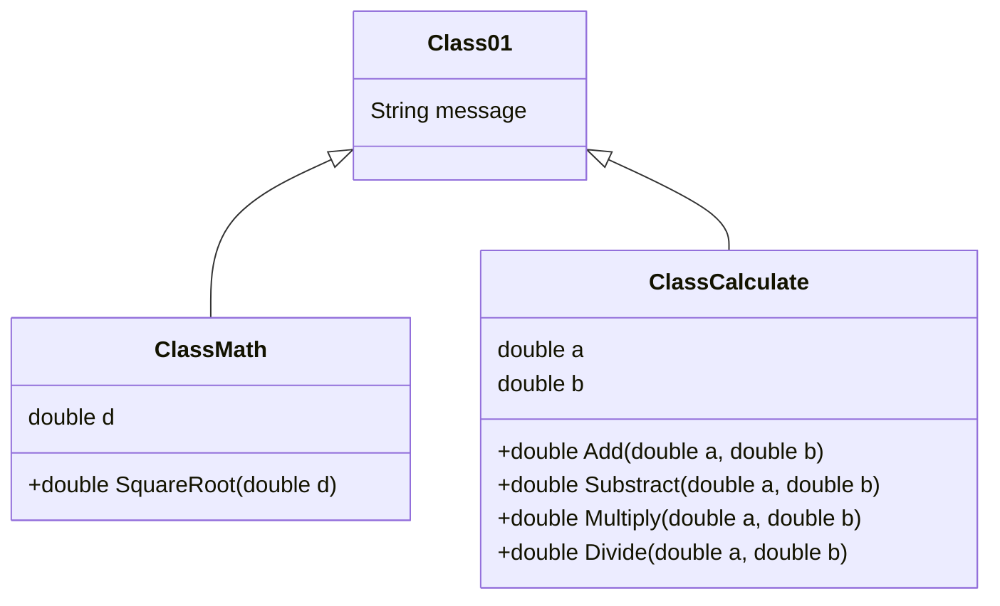

```mermaid
classDiagram
    Class01 <|-- ClassMath
    Class01 <|-- ClassCalculate

    ClassMath : +double SquareRoot(double d)
    ClassMath : double d

    ClassCalculate : +double Add(double a, double b)
    ClassCalculate : +double Substract(double a, double b)
    ClassCalculate : +double Multiply(double a, double b)
    ClassCalculate : +double Divide(double a, double b)
    ClassCalculate : double a
    ClassCalculate : double b

    Class01 : String message
```
